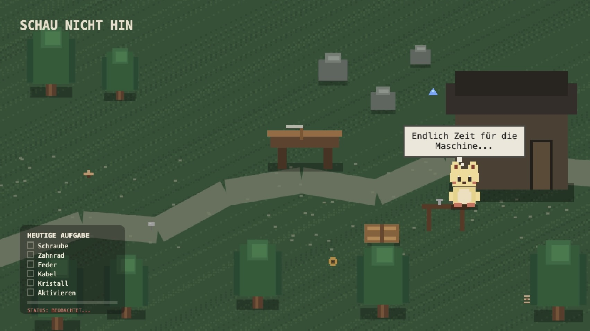

# Schau nicht hin.

„Schau nicht hin“ ist ein interaktives Spiel, bei dem du mit deiner Aufmerksamkeit das Geschehen beeinflusst. Die Idee dahinter ist, zu zeigen, dass Beobachtung und Aufmerksamkeit selbst Auswirkungen haben können, manchmal ist Wegschauen die beste Hilfe.

## Idee

Konzept / Frage: Das Projekt fragt: Was passiert, wenn unsere Aufmerksamkeit und unser Beobachten selbst zur Bedrohung werden?
Interaktion: Die Interaktion fühlt sich erst ruhig und neugierig an, wird aber schnell angespannt, weil man merkt, dass schon das Hinschauen Konsequenzen hat. Man möchte verstehen und beobachten, muss aber gleichzeitig lernen, wegzuschauen.

## Wie es funktioniert

- **Input:** Die Webcam erkennt das Gesicht, die Blickrichtung und ob die Augen geöffnet oder geschlossen sind.
- **Modell:** Verwendet wird der MediaPipe Face Landmarker als gehostetes Modell.
- **Output:** Je nachdem, ob man auf den Bildschirm schaut oder wegschaut, verändert sich das Verhalten der Figuren und das Spiel reagiert darauf.

## Starten

Was man braucht und wie man es startet.  z.B.:

1. Projekt herunterladen und die Dateien in einem Vite-Projekt ablegen.
2. Abhängigkeiten installieren: npm install @mediapipe/tasks-vision
3. Projekt starten: npm run dev
4. Im Browser öffnen und den Zugriff auf die Webcam erlauben.

## Gebaut mit

- MediaPipe für Face/Eye-Tracking
- Vibecoding mit Copilot.

## Kontext

Entstanden im Kurs "Konzeption und Entwurf Interaktiver Medien 2", Bergische Universität Wuppertal, Sommer Semester 2026.

